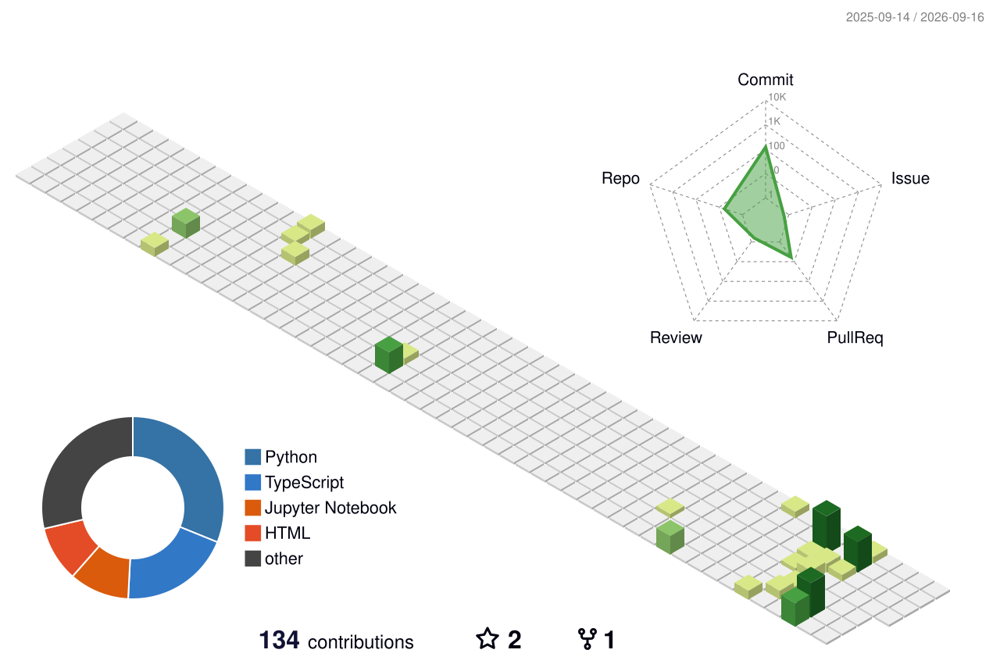

# Hi, I'm Yogeshwaran 👋

<div align="center">


<p>
  <a href="https://github.com/YogeshwaranP06">
    
  </a>
  <a href="mailto:YOUR_EMAIL@example.com">
    
  </a>
</p>

</div>

## About Me

```javascript
const yogeshwaran = {
  name: "Yogeshwaran",
  location: "India 🇮🇳",
  focus: [
    "Software development",
    "Problem solving",
    "Open source"
  ],
  currentlyLearning: [
    "Add your current topics here"
  ],
  goal: "Build simple, reliable solutions that help people"
};
```

## What I Do

<div align="center">

<table>
  <tr>
    <td align="center" width="33%">
      🚀<br>
      <strong>Build</strong><br>
      Practical projects and experiments
    </td>
    <td align="center" width="33%">
      🧠<br>
      <strong>Learn</strong><br>
      New tools, patterns, and ideas
    </td>
    <td align="center" width="33%">
      🤝<br>
      <strong>Collaborate</strong><br>
      Open source and team projects
    </td>
  </tr>
</table>

</div>

## Tech Stack

<div align="center">


</div>

## GitHub activity

<div align="center">



<br><br>

<p>
  View all my repositories:
  <a href="https://github.com/YogeshwaranP06?tab=repositories">
    GitHub Repositories
  </a>
</p>

</div>

## Contribution snake

<div align="center">

<picture>
  <source
    media="(prefers-color-scheme: dark)"
    srcset="https://raw.githubusercontent.com/YogeshwaranP06/yogeshwaranp06/main/dist/github-contribution-grid-snake-dark.svg"
  />
  
</picture>

</div>

## GitHub Stats

<p align="center">
  
  
</p>

<p align="center">
  
</p>

## Featured Projects

- **[Semiconductor Image Restoration](https://github.com/YogeshwaranP06/semiconductor-image-restoration)**  
  AI-based restoration of degraded semiconductor inspection images using deep learning.

- **[RoadRakshak](https://github.com/YogeshwaranP06/RoadRakshak)**  
  Real-time road anomaly detection using YOLO and edge AI.

- **[Network Protocol Analysis](https://github.com/YogeshwaranP06/network-protocol-analysis)**  
  Comparative analysis of TLS and QUIC using Wireshark and Python.

- **[Road Safety AI](https://yogeshwaranp06.github.io/road_safety/)**  
  AI-driven road safety solution developed for a national hackathon.

## Connect With Me

<div align="center">

<a href="https://www.linkedin.com/in/YOUR_USERNAME/">
  
</a>

<a href="https://twitter.com/YOUR_USERNAME">
  
</a>

<a href="mailto:YOUR_EMAIL@example.com">
  
</a>

</div>

<div align="center">

<br>


<br><br>

Thanks for visiting — keep building! ✨

</div>
